# Welcome to the SaveHeros Dashboard

## Our Team
Aditi Saini
Debashree Addi
Surabhi Malani

## The Problem Statement

We have decided to tackle the following problem:

> How might SCDF  leverage **wearables** to provide relief harsh operating conditions and maximise the **safety**, **health** and **performance** of First Responders during training andoperations?

## Our Proposed Solution
To ensure the physical health and mental resiliency of our First Responders, the strategy we want to adopt is to utilize the current wearable technology implemented which the amount ofphysical strain and With these valuable data, SCDF can potentially prevent the stress from escalating any further by ensuring a proactive approach for our frontline workers.

To strategize the optimal action to combat against emergent incidents, a state-of-the-art image classification model using IBM Cloud services is run. This AI model will help faciliate the SCDF Ops delegation process as with higher awareness of the emergency and extent of damage, resources can be more efficiently allocated. 

Credits: [How Wearable Tech Can Help Monitor First Responders Health](https://www.ems1.com/ems-products/computer-aided-dispatch-cad/articles/how-wearable-tech-can-help-monitor-first-responders-health-imJkMAlYuWvs9IoF/#:~:text=Smart%2C%20wearable%20technology%20has%20the,biological%2C%20chemical%20and%20radiation%20exposure)

### Current Technology Adopted by SCDF

#### Body Cams
Benefits
- Detailed accounts of incidents and emergencies. A valuable video resource
- Enhance real-life learned techniques for better, improved training
- Live-streaming, voice recording, incident bookmarking

Concerns
- Must ensure data protection of sensitive data. (Using 2FA to resolve)

Credits: [A Nation of Survivors 2019](https://www.scdf.gov.sg/docs/default-source/sgfpc-library/sgfpc/reaction2019_web.pdf)

#### Monitoring system to analyze air consumption during trainings and operation (Source: SCDFxIBM Slack)
To analyze environment conditions for our front line workers

## Pitch Video

Here is the video link: [The Three Muskeeters Pitch Video])(https://www.youtube.com/watch?v=8aMKQyXU880) 

## Architecture of Proposed Solution

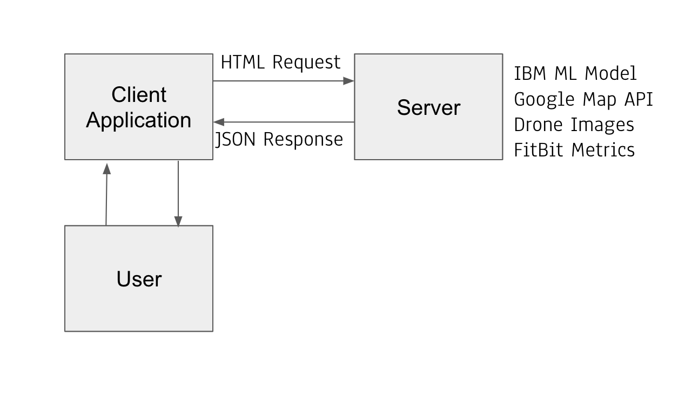

## Project Roadmap
WebApp Phase 1 (Aug - Sept 2020):   
1. Create a simple web demo of expected features.
2. Expected Features:  
    a. Integrate body-cam live stream footage 
    b. Integrate live-location tracking of each First Responder. Use GoogleMaps for a cleaner map interface.
    c. Integrate machine learning models to detect severity of incident and predict necessary resources needed
3. Code Review
4. Security Authentication to ensure data protection and no leakage of sensitive data.    

Expectations
1. SCDF ops must be able to live-stream the incident on sight through their portal to access the danger
2. SCDF ops must be able to trace the location of all First Responders on duty.

MobileApp Phase 1 (Aug - Sept 2020):
1. Allow firefighters on site to view the live stream body cam of the other firefighters
2. Allow firefighters on site to trace location of other firefighters.
3. Code Review
4. Security Authentication to ensure data protection and no leakage of sensitive data. 

WebApp Phase 2 (Sept - Dec 2020):  
1. Introduce new smart wearables for firefighters which can measure heart rate, blood sugar level, stress level (etc other indicators of health and well being)
2. Integrate live streaming of sensitive data
3. Establish a baseline of prime health and critical health which may vary from First Responders.
4. Do a comprehensive health check on First Responders and stress tests to store these sensitive information.
5. Code Review
6. Security Authentication to ensure data protection and no leakage of sensitive data. 

MobileApp Phase 2 (Sept - Dec 2020):
1. Allow firefighters on site to view the health of the other firefighters
2. Alert nearby firefighters of firefighter with critical health
3. Code Review
4. Security Authentication to ensure data protection and no leakage of sensitive data. 

WebApp Phase 3 (Dec 2020 - Feb 2021):
1. Introduce drones which can analyze the health conditions of the incident, expected stress level, and expected manpower required. Sending real time video stream data as well.
2. Integrate new feature to reflect drone data

MobileApp Phase 3 (Dec 2020 - Feb 2021):
1. Allow firefighters on site to view damage at incident to get prepared
3. Code Review
4. Security Authentication to ensure data protection and no leakage of sensitive data. 

## Getting Started
1. Clone the repository
2. Download all dependencies
    ``` npm i```
3. Run the application ``` npm start``` 

## Running the tests

### Live Status of Firefighters
 Start Screen

 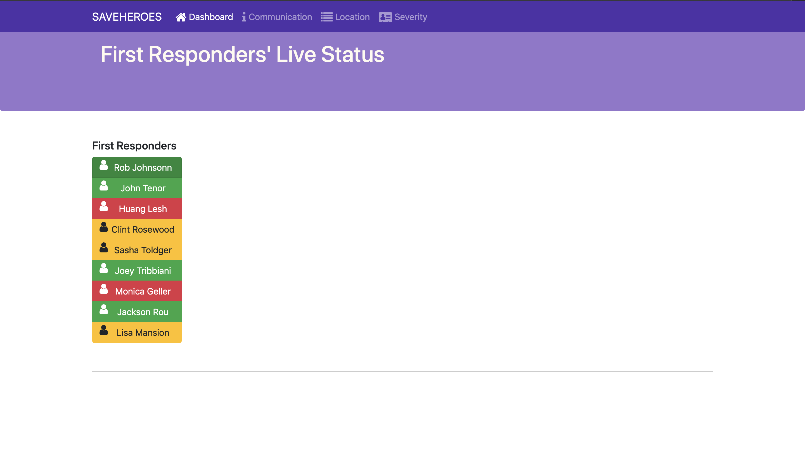

 Click on healthy firefighter `Rob Johnson`

 

 Click on critical firefighter `Huang Lesh`

 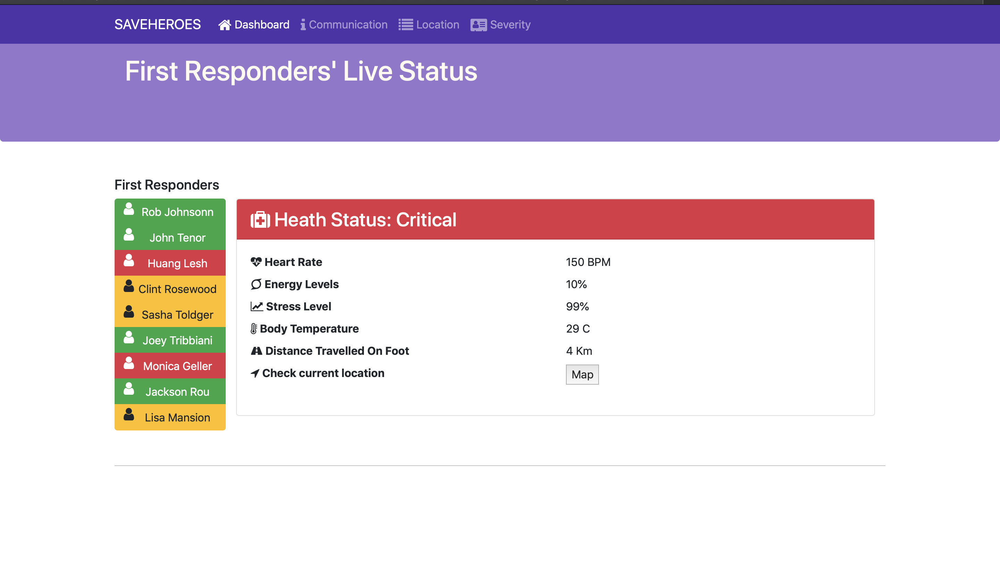

 Find location of critical firefighter
 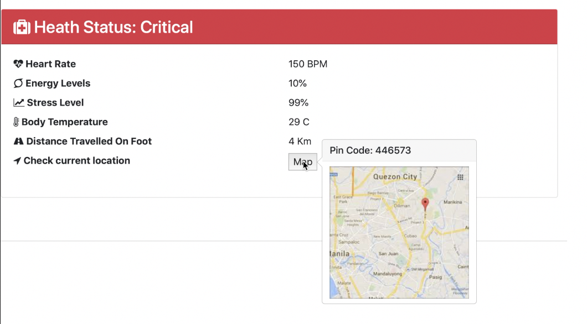

Notice can monitor the following metrics:
- `Heart Rate`
- `Energy Levels`
- `Stress Level`
- `Body Temperature`
- `Distance Travelled On Foot`
- `Check current location`

### Communication Channel for Firefighters
Start screen

Commander-in-chief can send critical information to respective firefighters stat. 

 

Illustrate chat channel between Commander and FireFighter

 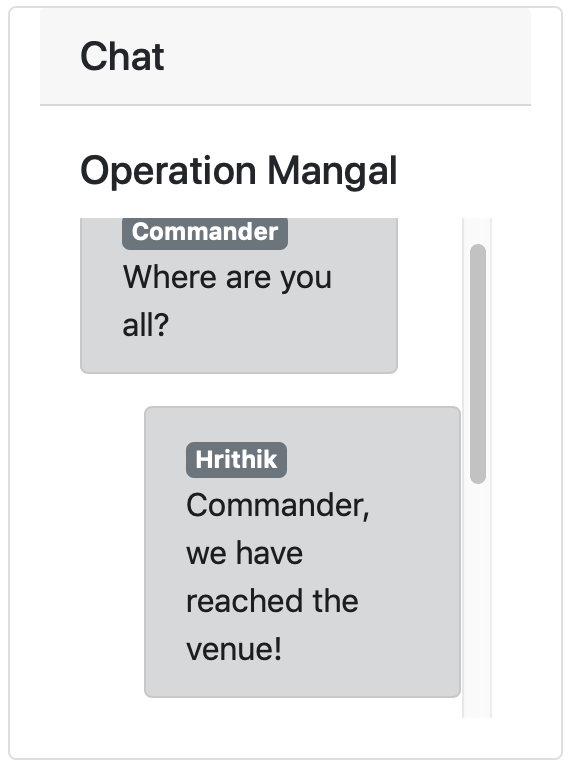

Broadcast critical message to Hrithik Roshan via audio!
 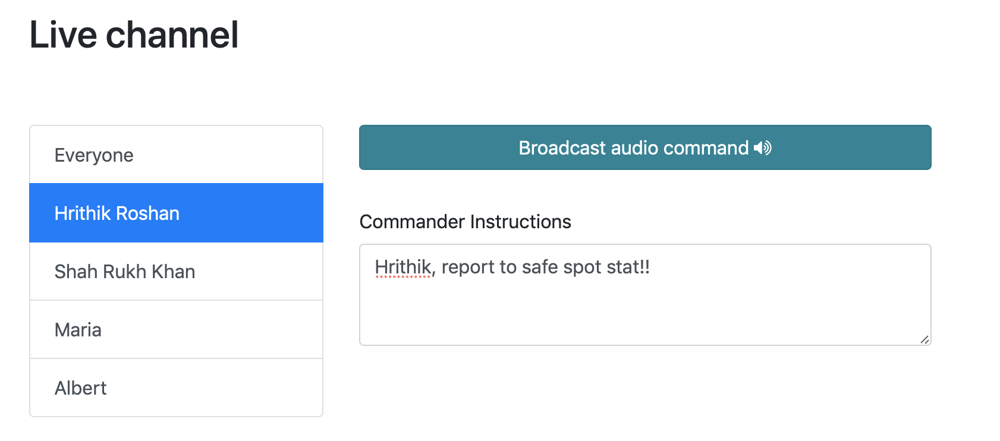

### Location Tracker for Firefighters

SCDF Ops can trace location of all firefighters on duty
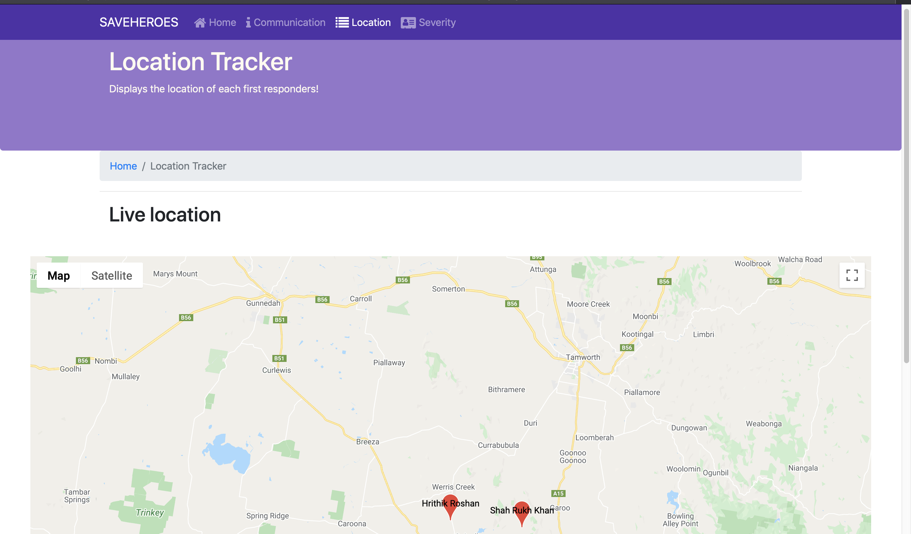

SCDF ops can zoom in and interact with the map and find the firefighters.
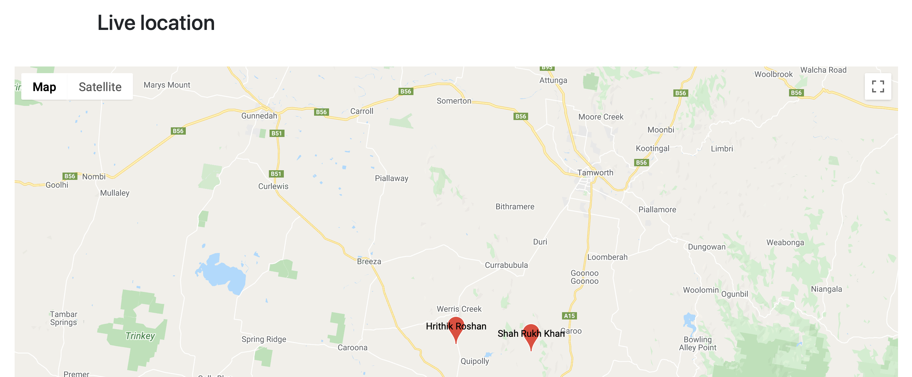

### View severity of all incidents

SCDF Ops can view all the incidents currently happening, and a picture to assess the damage
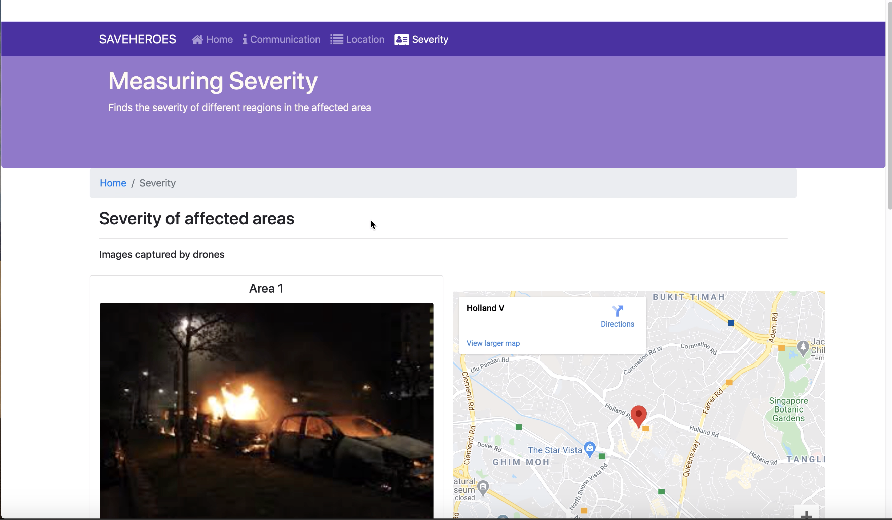

SCDF ops can view all the areas and analyze damages

Low Damage
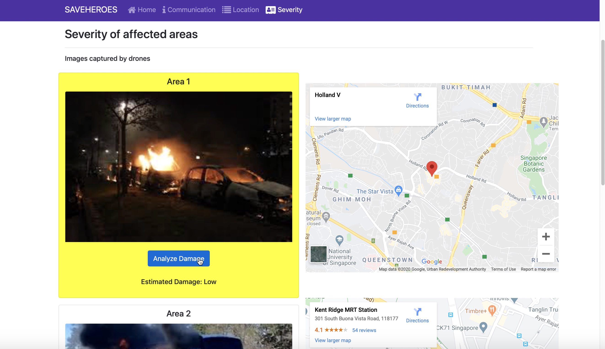

Moderate Damage
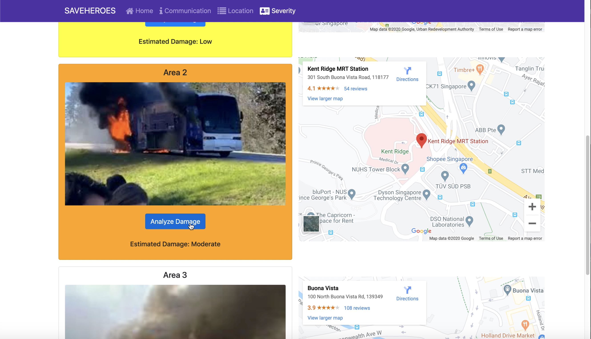

Severe Damage
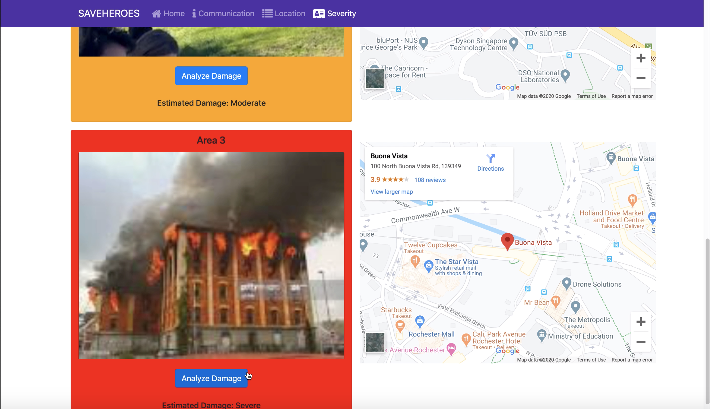


## Tech stack used
1. React
2. Bootstrap
3. HTML
4. CSS
5. JS
6. IBM Watson Cloud